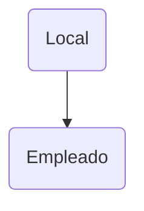

---
{"dg-publish":true,"permalink":"/3-resources/zettelkasten/crude/modelo-e-r/","created":"2026-03-03T13:38:21.325-03:00","updated":"2026-03-19T17:30:07.136-03:00"}
---

Es un modelo conceptual que se utiliza para describir una base de datos sin definir aún que base de datos. Una representación abstracta del problema, e independiente de cualquier motor de base de datos. Llamado Modelo Entidad-Relación

Tiene tres elementos básicos
- [[3-Resources/Zettelkasten/Crude/Modelo E-R#Entidades\|Entidades]]
- [[3-Resources/Zettelkasten/Crude/Modelo E-R#Interrelaciones\|Interrelaciones]]
- [[3-Resources/Zettelkasten/Crude/Modelo E-R#Atributos\|Atributos]]

# Elementos
## Entidades
**Representan objetos o conceptos del mundo real con identidad**
***Ejemplo***
- Alumno
- Local
- Materia
*-Se dibujan con rectángulos*

## Interrelaciones
- **Agregaciones** de entidades
- **Cardinalidad**
	- Mínima 
	- Máxima
***Ejemplo***
Persona -> *NacioEn* -> Ciudad

### Relaciones
**Indican como se vinculan entidades**
- Alumno **cursa** materia
- Profesor **dicta** materia
*-Se dibujan como rombos* 

## Atributos
**Son las propiedades de una entidad**

***Ejemplos***
Alumno -> nroLegajo, nombre, dni, etc.

### Identificadores
**Son atributos que identifican de forma única a la entidad**
- Local identificado por **Dirección**
- Alumno identificado por **Legajo**
Los atributos opcionales no pueden ser identificadores, y el **identificador se puede heredar de una entidad padre**

Existen **entidades fuertes** y **entidades débiles**.
- **Entidades Fuertes**: Pueden identificarse internamente
- **Entidades Débiles**: Sólo poseen identificadores externos -> *Neceistan la existencia de otra entidad*

Alumno es una **entidad fuerte**

Articulo es una **entidad débil** que depende de la *entidad revista*

### Atributos Compuestos
**Grupos de atributos que tienen *afinidad* en cuanto a su significado o su uso** 

# Jerarquías de Generalización
Toda entidad $E$ es una generalización de cualquier entidad $E_i$ creada a partir de la clase $E$, y si se crea una subclase o subconjunto de clases a partir de una clase, se **hereda** todos los atributos, interrelación o generalización definido para la clase genérica.
## Cobertura
- Total o parcial
- Exclusiva o superpuesta

### Total
**Todas las clases subconjunto contienen los elementos de la genérica**
### Parcial
**Algún elemento de la clase genérica no corresponde con ningún elemento de las clases subconjunto**
### Exclusiva
**Una instancia no puede ser más de una subclase**
### Superpuesta
**Una instancia puede ser más de una subclase**