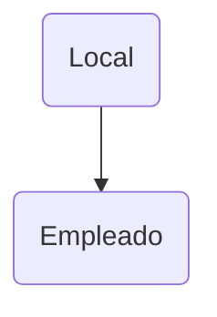
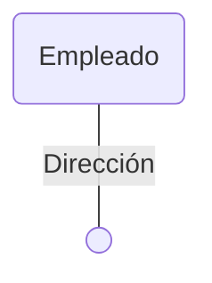
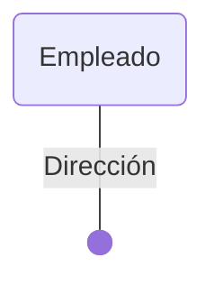
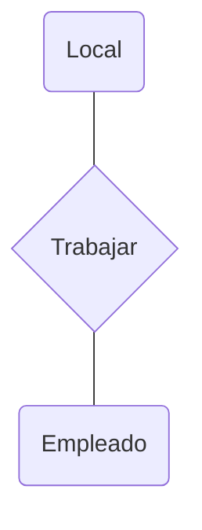
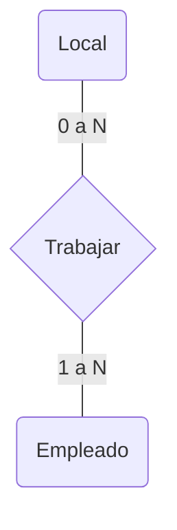

---
{"dg-publish":true,"permalink":"/3-resources/zettelkasten/crude/modelo-e-r/","created":"2026-03-03T13:38:21.325-03:00","updated":"2026-03-17T17:26:38.884-03:00"}
---

Es un modelo conceptual que se utiliza para describir una base de datos sin definir aún que base de datos. Una representación abstracta del problema, e independiente de cualquier motor de base de datos. Llamado Modelo Entidad-Relación

# Entidades
**Representan objetos o conceptos del mundo real**
- Alumno
- Local
- Materia
*-Se dibujan con rectángulos*

# Atributos
**Son las propiedades de una entidad**
- Dirección
- Legajo
- Nombre
*-Se dibujan con puntos blancos*

# Claves
**Son atributos que identifican de forma única a la entidad**
- Local identificado por **Dirección**
- Alumno identificado por **Legajo**
*-Se dibujan con puntos negros*

# Relaciones
**Indican como se vinculan entidades**
- Alumno **cursa** materia
- Profesor **dicta** materia
*-Se dibujan como rombos* 

# Cardinalidades
**Indica cuantos participan de la relación**
- 1 a 1
- 1 a N
- N a M

