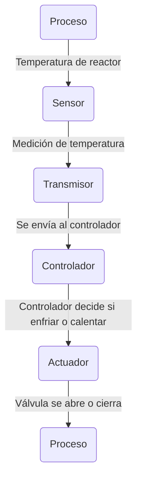

---
{"dg-publish":true,"permalink":"/3-resources/zettelkasten/resume/lazos-de-control/","created":"2026-03-05T18:50:28.344-03:00","updated":"2026-03-17T17:29:10.698-03:00"}
---

> [!info] Definición
> Conjunto de elementos que miden una variable del [[3-Resources/Zettelkasten/Resume/Proceso en I&C\|proceso]] y la corrigen automáticamente.

